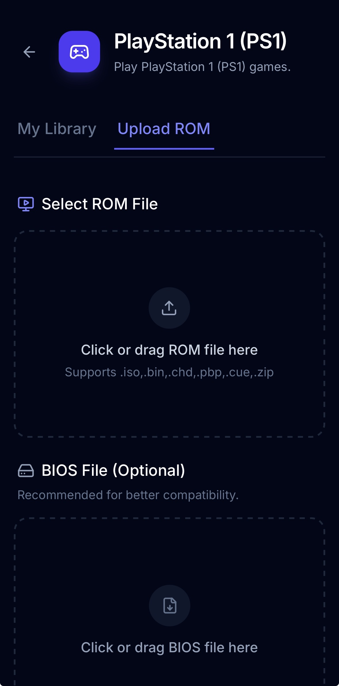
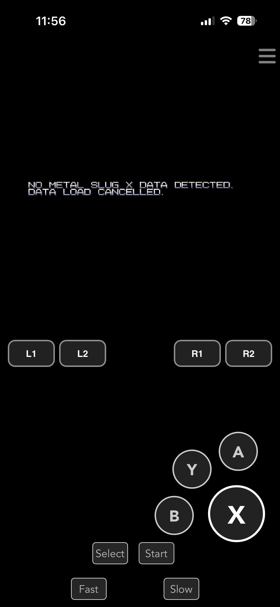
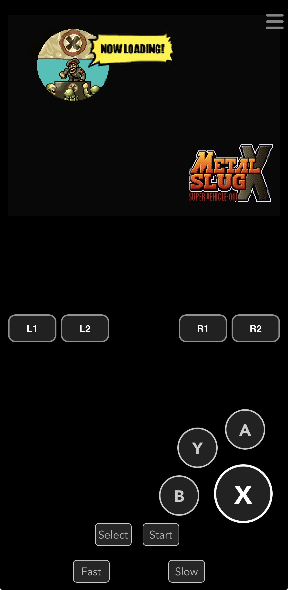

<div align="center">

# 🕹️ Retro Web Emulator

**Play classic retro console games directly in your browser — no installation required.**

[](https://react.dev/)
[](https://www.typescriptlang.org/)
[](https://vitejs.dev/)
[](https://tailwindcss.com/)
[](https://web.dev/progressive-web-apps/)

### 🌐 [Live Demo → retrogame.merakistore.app](https://retrogame.merakistore.app/)

</div>

---

## 📸 Screenshots

<div align="center">

| ROM Upload | Loading Game | Gameplay |
|:----------:|:------------:|:--------:|
|  |  |  |
| Select & upload your ROM file | Game loading screen | Metal Slug X with touch controls |

</div>

---

## ✨ About

**Retro Web Emulator** is a Progressive Web App (PWA) that lets you play classic retro console games directly in your browser — no software installation needed.

It supports **7 iconic consoles** from the golden age of gaming, all wrapped in a clean and modern interface.

---

## 🎮 Supported Consoles

| Console | Core | Route |
|---------|------|-------|
| 🕹️ Arcade / NeoGeo | `fbneo` | `/neogeo` |
| 🎮 PlayStation 1 | `psx` | `/psx` |
| 🟥 Nintendo 64 | `n64` | `/n64` |
| 🟣 Super Nintendo (SNES) | `snes` | `/snes` |
| ⬜ Nintendo (NES) | `nes` | `/nes` |
| 🟡 Game Boy Advance | `gba` | `/gba` |
| 🔵 Sega Mega Drive | `genesis` | `/segag` |

---

## 🚀 Getting Started

### Prerequisites

- [Node.js](https://nodejs.org/) v18 or higher
- npm / yarn / pnpm

### Installation

```bash
# 1. Clone the repository
git clone https://github.com/amirulasraf89/web-retro-emulator.git
cd web-retro-emulator

# 2. Copy environment file
cp .env.example .env

# 3. Install dependencies
npm install

# 4. Start the development server
npm run dev
```

Open your browser and go to **http://localhost:3000**

### Build for Production

```bash
npm run build
npm run preview
```

---

## 🗂️ Project Structure

```
web-retro-emulator/
├── src/
│   ├── pages/          # Individual console pages (psx, n64, snes, gba...)
│   ├── components/     # Reusable components (ConsolePlayer)
│   ├── App.tsx         # Main routing setup
│   └── main.tsx        # Application entry point
├── public/             # Static assets & PWA files
├── dist/               # Build output (auto-generated)
├── vite.config.ts      # Vite + PWA configuration
└── vercel.json         # Vercel deployment config
```

---

## 🛠️ Tech Stack

| Technology | Purpose |
|------------|---------|
| **React 19** | UI framework |
| **TypeScript** | Static typing |
| **Vite** | Build tool |
| **Tailwind CSS v4** | Styling |
| **React Router v7** | Client-side routing |
| **vite-plugin-pwa** | PWA support |
| **Lucide React** | Icons |
| **Motion** | Animations |
| **Google GenAI** | AI integration |

---

## ☁️ Deployment

This project is configured for deployment on **Vercel** and **Firebase Hosting**.

### Vercel (Recommended)

```bash
npx vercel --prod
```

### Firebase

```bash
npm run build
firebase deploy
```

---

## 📄 License

This project is built for educational and personal use.  
Please ensure you legally own any ROMs you play.

---

<div align="center">

Made with ❤️ by **[amirulasraf89](https://github.com/amirulasraf89)**

</div>
